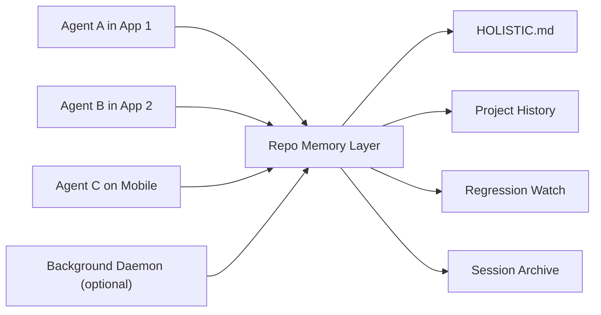

# Holistic

Cross-agent, cross-platform memory for project work.

Holistic exists for the moment when you switch from one AI coding tool to another and suddenly have to explain your project all over again.

You fixed something with one agent. Another agent came in later, changed the same area, and broke the first fix. Then a third agent repaired the new bug but had no memory of why the earlier change mattered in the first place.

That loop is expensive, frustrating, and very common.

Holistic gives your repo a durable memory layer so the next agent can understand:

- what changed
- why it changed
- what already worked
- what regressed
- what should happen next

## Quick links

- [Walkthrough](./docs/handoff-walkthrough.md)
- [Contributing](./CONTRIBUTING.md)
- [License](./LICENSE)

## Why Holistic exists

Modern project work is spread across tools and devices:

- Claude in one desktop app
- Codex in another
- Antigravity in an IDE
- mobile sessions from your phone
- quick follow-ups from a second machine

The repo is the only thing all of those sessions reliably share.

Holistic turns the repo into a portable project memory system.

## The pain it solves

| Pain | What usually happens | What Holistic changes |
| --- | --- | --- |
| Repeating context every session | You restate goals, attempts, blockers, and next steps from scratch | A repo-visible handoff becomes the starting point |
| Agents breaking earlier fixes | A new agent changes behavior without knowing what was previously repaired | Regression memory and long-term history call out what must not break again |
| Losing work when context compacts | Important decisions disappear with the conversation window | Checkpoints and handoffs write durable state into the repo |
| Switching devices | Your laptop knows something your phone session does not | Memory lives with the repo, not one machine |
| Tool fragmentation | Every app has different conventions and no shared memory | Holistic gives them a common protocol anchored in the repo |

## What Holistic is

Holistic is a repo-first handoff and memory system for AI-assisted project work.

It combines:

- a canonical repo entrypoint: `HOLISTIC.md`
- machine-readable state in `.holistic/state.json`
- append-only session archives in `.holistic/sessions/`
- long-term project history
- a regression watchlist
- optional background capture on devices where a daemon is installed
- a dedicated state branch for clean cross-device sync

## Core idea



The repo becomes the shared memory surface.

That means the next session does not depend on which app you used last, or which device you used it on.

## How it works

### 1. One-time init

Initialize Holistic in a repo once:

```bash
holistic init --remote origin --state-branch holistic/state
```

That setup creates:

- `HOLISTIC.md` as the main handoff entrypoint
- `.holistic/` for structured state and memory docs
- adapter docs for supported agent environments
- optional system artifacts for passive capture and sync

### 2. During a work session

Holistic captures the current objective, latest status, attempted paths, assumptions, blockers, impacts, and next steps.

On devices where the daemon is installed, Holistic can also watch the repo and create passive checkpoints in the background.

### 3. Ending a session

When you explicitly end a session, the agent should:

- produce a handoff summary
- show it to you for review
- let you edit or add anything missing
- finalize the handoff docs
- preserve unfinished work for later
- sync portable state for the next device or agent

### 4. Starting the next session

The next agent should:

1. read `HOLISTIC.md`
2. review project history and regression memory
3. recap where things stand
4. ask whether to continue, tweak the plan, or start something new

## Architecture

### Repo-first, not machine-first

Holistic is designed around a simple truth:

your laptop daemon cannot help a session that starts on your phone.

So the architecture is intentionally split:

| Layer | Purpose | Portable? |
| --- | --- | --- |
| Repo memory | Shared handoff, history, regression, and session state | Yes |
| State branch | Cross-device distribution of Holistic state | Yes |
| Local daemon | Passive capture on one machine | No |

This is what makes Holistic cross-agent and cross-platform.

## Long-term memory matters

Holistic is not just about "what am I doing right now?"

It is also about:

- what an agent changed last week
- why that change mattered
- what side effects it caused
- what another agent did to fix the side effects
- what should stay fixed from now on

That long-term memory is what helps stop the cycle of:

1. fix a bug
2. re-break the bug later
3. fix the regression
4. accidentally undo the regression fix

## Included commands

| Command | Purpose |
| --- | --- |
| `holistic init` | Initialize Holistic for a repo |
| `holistic resume` | Produce a recap and recovery flow |
| `holistic checkpoint` | Save durable mid-session state |
| `holistic handoff` | Finalize the session handoff |
| `holistic start-new` | Start a fresh tracked session while preserving unfinished work |
| `holistic watch` | Foreground watch mode for automatic checkpoints |

## Example workflow

```text
Session 1 in Cowork
  -> work happens
  -> handoff is finalized
  -> portable state is synced

Session 2 in Antigravity
  -> repo is opened
  -> Holistic recap is read
  -> unfinished work and regression risks are visible
  -> work continues without re-briefing

Session 3 on mobile with Codex
  -> repo is available
  -> last handoff and project history are still there
  -> the agent can continue with shared context
```

## What makes this different

- It treats the repo as the shared memory contract.
- It preserves both short-term handoff state and long-term project history.
- It explicitly tracks regressions and durable impact, not just todo items.
- It works across agents, apps, and devices as long as they can access the repo.
- It does not rely on a single vendor, interface, or machine.

## Status

Holistic v1 is focused on a practical, durable foundation:

- repo-visible memory
- structured session state
- long-term archive and regression tracking
- portable state sync
- optional daemon-based passive capture

## Vision

The goal is simple:

your project should remember what the agents forget.
