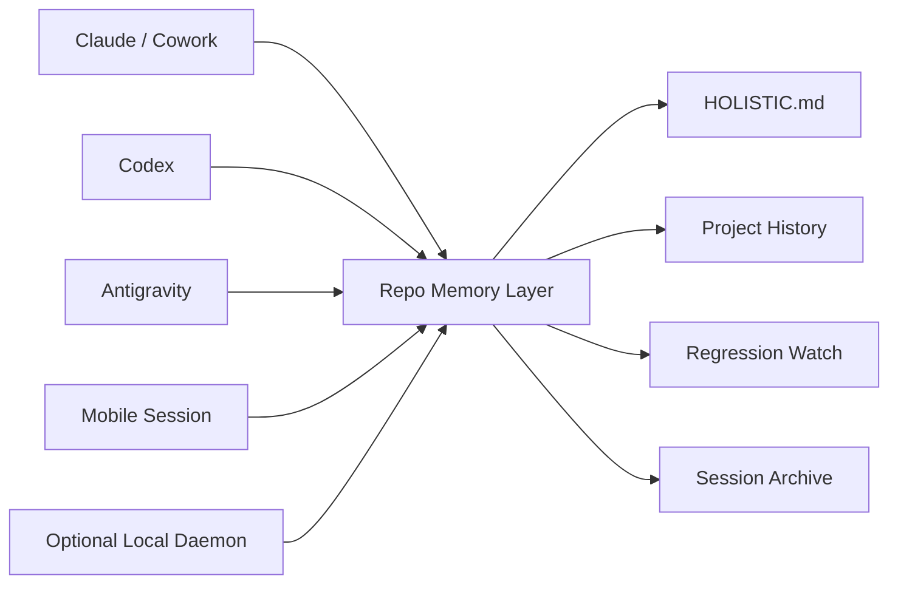

# Holistic

:brain: Cross-agent, cross-platform memory for AI coding work.

Holistic is for people who are building with multiple AI coding assistants and are tired of paying the context tax every time they switch tools.

You make progress in one app.  
Another agent picks up later and asks you to explain everything again.  
A third agent "fixes" something that was already fixed.  
A fourth agent solves the new bug but has no idea why the earlier change mattered.

That is the problem Holistic solves.

## The short version

Holistic turns your repo into a shared memory layer for project work so every new agent can quickly understand:

- :white_check_mark: what changed
- :white_check_mark: why it changed
- :white_check_mark: what has already been tried
- :white_check_mark: what must not regress
- :white_check_mark: what should happen next

If you use Claude, Codex, Antigravity, mobile sessions, desktop apps, IDE agents, or a mix of all of them, Holistic is designed for that reality.

## Quick links

- [Walkthrough](./docs/handoff-walkthrough.md)
- [Contributing](./CONTRIBUTING.md)
- [License](./LICENSE)

## Why people need this

If this sounds familiar, Holistic is probably for you:

- "I already explained this to another agent earlier today."
- "Why did it change that? We already fixed this."
- "It solved the bug, but broke the previous fix."
- "I switched from laptop to phone and lost the thread."
- "The app changed, so the context basically reset."
- "I know we already decided this once, but I cannot prove it to the next agent."

That repeated re-briefing and regression loop is one of the biggest hidden costs of AI-assisted development.

Holistic makes the repo remember what the agents forget. :repeat:

## What Holistic is

Holistic is a repo-first handoff and memory system for AI coding assistants.

It gives your project a durable memory layer that survives:

- agent switches
- app switches
- device switches
- context compaction
- half-finished sessions
- repeated regressions

It combines:

- `HOLISTIC.md` as the first file an agent should read
- `.holistic/state.json` as machine-readable state
- `.holistic/sessions/` as append-only session history
- long-term project history
- a regression watchlist
- optional passive capture on devices with a daemon installed
- a dedicated state branch for clean cross-device sync

## The pain it solves

| Pain | What usually happens | What Holistic changes |
| --- | --- | --- |
| Repeating context every session | You restate goals, attempts, blockers, and next steps from scratch | A repo-visible handoff becomes the starting point |
| Agents breaking earlier fixes | A new agent changes behavior without knowing what was previously repaired | Regression memory and long-term history call out what must not break again |
| Losing work when context compacts | Important decisions disappear with the conversation window | Checkpoints and handoffs write durable state into the repo |
| Switching devices | Your laptop knows something your phone session does not | Memory lives with the repo, not one machine |
| Tool fragmentation | Every app has different conventions and no shared memory | Holistic gives them a common protocol anchored in the repo |
| "We already solved this" fatigue | The same problems get revisited because prior rationale is missing | Historical memory preserves what changed, why, and what the overall impact was |

## Why Holistic feels different

:sparkles: It is built around the real workflow people already have, not the one tooling wishes they had.

Most people are not using one agent in one perfect environment.
They are using:

- a desktop assistant here
- an IDE agent there
- a mobile follow-up later
- a second machine tomorrow

Holistic assumes that mess is normal.

Instead of trying to force every tool into one vendor-specific workflow, Holistic makes the repo itself the shared memory contract.

That is what makes it:

- cross-agent
- cross-app
- cross-platform
- cross-device
- repo-native

## Core idea



The repo becomes the shared memory surface.

That means the next session does not depend on which app you used last, or which device you used it on.

## Why this matters so much

AI coding workflows break down when memory is shallow.

A project is not just:

- the current task
- the current diff
- the latest conversation

A project also includes:

- why a fix was made
- what tradeoff it introduced
- what broke afterward
- what was deliberately preserved
- what future agents should avoid undoing

Holistic is built to preserve that deeper project memory so the next agent can work with context instead of guesswork.

## How it works

### 1. One-time init

Initialize Holistic in a repo once:

```bash
holistic init --remote origin --state-branch holistic/state
```

That setup creates:

- `HOLISTIC.md` as the main handoff entrypoint
- `.holistic/` for structured state and memory docs
- adapter docs for supported agent environments
- optional system artifacts for passive capture and sync

### 2. During a work session

Holistic captures the current objective, latest status, attempted paths, assumptions, blockers, impact, and next steps.

On devices where the daemon is installed, Holistic can also watch the repo and create passive checkpoints in the background.

### 3. Ending a session

When you explicitly end a session, the agent should:

- produce a handoff summary
- show it to you for review
- let you edit or add anything missing
- finalize the handoff docs
- preserve unfinished work for later
- sync portable state for the next device or agent

### 4. Starting the next session

The next agent should:

1. read `HOLISTIC.md`
2. review project history and regression memory
3. recap where things stand
4. ask whether to continue, tweak the plan, or start something new

## Architecture

### Repo-first, not machine-first

Holistic is designed around a simple truth:

:iphone: a daemon on your laptop cannot help a session that starts on your phone.

So the architecture is intentionally split:

| Layer | Purpose | Portable? |
| --- | --- | --- |
| Repo memory | Shared handoff, history, regression, and session state | Yes |
| State branch | Cross-device distribution of Holistic state | Yes |
| Local daemon | Passive capture on one machine | No |

This is what makes Holistic genuinely cross-agent and cross-platform instead of laptop-bound.

## Long-term memory matters

Holistic is not just about "what am I doing right now?"

It is also about:

- what an agent changed last week
- why that change mattered
- what side effects it caused
- what another agent did to fix those side effects
- what should stay fixed from now on

That long-term memory helps stop the cycle of:

1. fix a bug
2. re-break the bug later
3. fix the regression
4. accidentally undo the regression fix

## Included commands

| Command | Purpose |
| --- | --- |
| `holistic init` | Initialize Holistic for a repo |
| `holistic resume` | Produce a recap and recovery flow |
| `holistic checkpoint` | Save durable mid-session state |
| `holistic handoff` | Finalize the session handoff |
| `holistic start-new` | Start a fresh tracked session while preserving unfinished work |
| `holistic watch` | Foreground watch mode for automatic checkpoints |

## Example workflow

```text
Session 1 in Cowork
  -> work happens
  -> handoff is finalized
  -> portable state is synced

Session 2 in Antigravity
  -> repo is opened
  -> Holistic recap is read
  -> unfinished work and regression risks are visible
  -> work continues without re-briefing

Session 3 on mobile with Codex
  -> repo is available
  -> last handoff and project history are still there
  -> the agent can continue with shared context
```

## What makes this a no-brainer

If you are already using more than one AI coding assistant, you already have the problem.

Holistic gives you:

- less repeated explanation
- fewer accidental regressions
- clearer handoffs
- better continuity across devices
- a durable record of what changed and why

In other words: less thrash, more forward motion. :rocket:

## Status

Holistic v1 is focused on a practical, durable foundation:

- repo-visible memory
- structured session state
- long-term archive and regression tracking
- portable state sync
- optional daemon-based passive capture

## Vision

The goal is simple:

Your project should remember what the agents forget.
