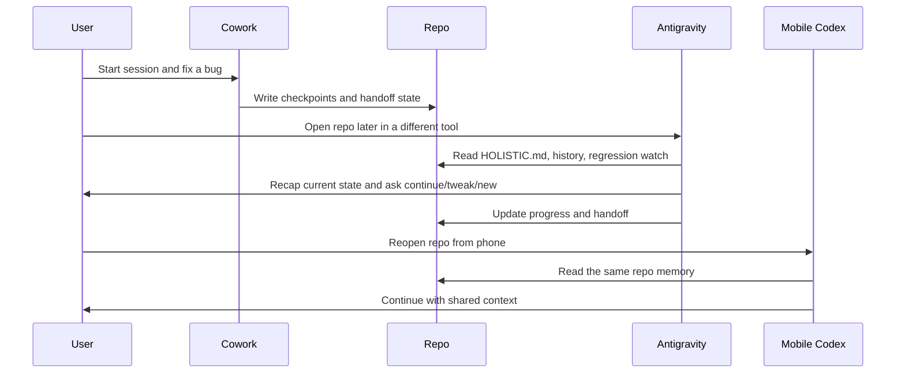

# Cross-Agent Handoff Walkthrough

This is a practical example of the workflow Holistic is built for.

## Scenario

You start work in one agent, switch tools later, then pick the same project back up from a phone session.

Without Holistic, each session starts with a re-brief.

With Holistic, the repo carries the memory forward.

## The problem in one diagram

## Step-by-step

### 1. Session starts in Cowork

The agent should read:

- `HOLISTIC.md`
- `.holistic/context/project-history.md`
- `.holistic/context/regression-watch.md`

Then it should recap:

- the active objective
- the latest status
- what has already been tried
- what should happen next

### 2. Work happens

Mid-session, Holistic should preserve:

- the current goal
- any attempted fixes
- important assumptions
- blockers
- project impact
- regression risks

This matters when a future agent touches the same files but does not share the original context window.

### 3. Session ends

At handoff time, the agent should show a summary for review before finalizing it.

That handoff should answer:

| Question | Example |
| --- | --- |
| What changed? | Added resume flow state and daemon setup |
| Why did it change? | To preserve context across agent switches |
| What still needs attention? | Test sync behavior from a second device |
| What must not regress? | Do not lose active goal when a new session starts |

### 4. A different agent picks up later

When Antigravity opens the repo, it should not need a fresh brief from scratch.

Its first 30 seconds should look like this:

1. read the Holistic entrypoint
2. read history and regression memory
3. recap the last known state
4. ask whether to continue, tweak, or start something new

## What a good recap sounds like

> Current objective: finish the sync handoff flow.  
> Latest status: the state branch automation is in place.  
> Already tried: generated restore and sync helpers for Windows, macOS, and Linux.  
> Try next: verify the handoff flow from a second device.  
> Regression watch: do not lose the prior unfinished task when a new session starts.

## What gets better over time

Holistic becomes more valuable the more often the project changes hands.

That long-term archive helps future agents see:

- which fixes were durable
- which changes created regressions
- what tradeoffs were already accepted
- what not to "clean up" without understanding the original reason

## Why this works on mobile too

The portable layer is the repo itself.

A laptop daemon can improve passive capture on that laptop, but the real continuity comes from:

- repo-visible handoff docs
- long-term project history
- regression watch memory
- portable state synced through git

That is why Holistic is cross-agent and cross-platform instead of laptop-bound.

