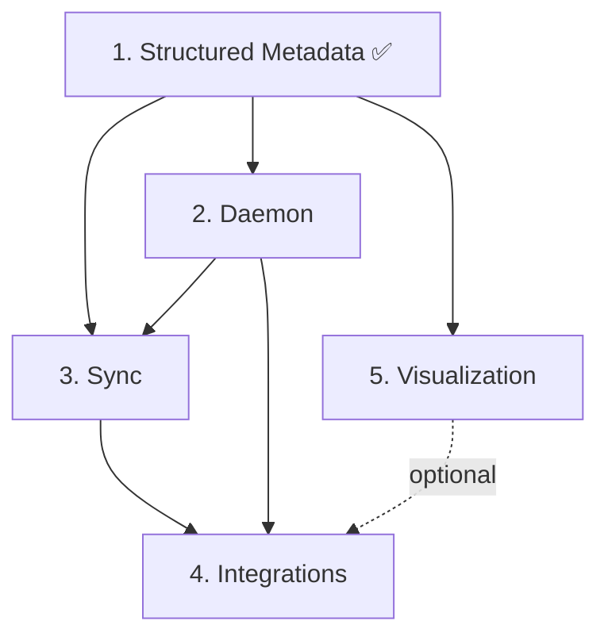

# Holistic Roadmap

This directory contains detailed implementation plans for upcoming Holistic features. Each roadmap document includes tasks, validation steps, testing strategy, and success criteria.

## Status Overview

| # | Feature | Priority | Complexity | Status | Docs |
|---|---------|----------|------------|--------|------|
| 1 | **Structured Metadata** | High | Low-Medium | ✅ **Complete** | [docs/structured-metadata.md](../structured-metadata.md) |
| 2 | **Daemon Passive Capture** | High | Medium | 📋 Planned | [02-daemon-passive-capture.md](./02-daemon-passive-capture.md) |
| 3 | **Cross-Device Sync** | High | Medium-High | 📋 Planned | [03-cross-device-sync.md](./03-cross-device-sync.md) |
| 4 | **Agent Integrations** | Medium-High | Low-Medium | 📋 Planned | [04-agent-integrations.md](./04-agent-integrations.md) |
| 5 | **Visualization & Search** | Medium | Medium | 📋 Planned | [05-visualization-search.md](./05-visualization-search.md) |

---

## 1. Structured Metadata ✅

**Completed:** March 20, 2026

Enhanced history and regression docs with rich metadata:
- Severity levels (critical, high, medium, low, info)
- Area tags (cli, daemon, state-management, docs, etc.)
- Outcome status (success, partial, failed, ongoing)
- Validation checklists for regression prevention
- Session relationships and dependencies

**Impact:** Agents can now quickly filter and assess importance of historical changes. Backward compatible with existing plain-text sessions.

**Regressions to guard:**
- Do not remove legacy `impactNotes` and `regressionRisks` string arrays - needed for backward compatibility
- Rendering logic must prefer structured metadata when available, fall back gracefully to plain text

---

## 2. Daemon Passive Capture

**Goal:** Enable true zero-touch background capture where the daemon watches the repo and creates automatic checkpoints when meaningful changes occur.

**Key features:**
- Background file watcher with smart debouncing
- Auto-checkpoint on commits, branch switches, significant file changes
- Platform-specific service installers (Windows Task Scheduler, macOS LaunchAgent, Linux systemd)
- Daemon health monitoring and auto-restart
- Configurable watch patterns and sensitivity

**Estimated effort:** 2-3 sessions  
**Affected areas:** `daemon`, `state-management`, `git-integration`

**Success criteria:**
- Daemon starts automatically on system boot (all platforms)
- Auto-checkpoints created within 30s of meaningful changes
- Zero manual `holistic checkpoint` commands needed for normal work
- Daemon uptime >99% with automatic restart after crashes
- CPU usage <1% idle, <5% during active file changes

[Full plan →](./02-daemon-passive-capture.md)

---

## 3. Cross-Device State Sync

**Goal:** Make cross-device continuity seamless by automating state synchronization via the dedicated `holistic/state` branch.

**Key features:**
- `holistic sync` and `holistic pull` commands for manual sync
- Auto-sync on handoff, auto-pull on resume
- Conflict resolution when two devices both create handoffs offline
- State branch isolation (never merges into working branches)
- Sync status tracking and health checks

**Estimated effort:** 2-3 sessions  
**Affected areas:** `sync`, `git-integration`, `cli`, `state-management`

**Success criteria:**
- Auto-sync works on all platforms (Windows, macOS, Linux)
- Zero manual git commands needed for cross-device continuity
- Conflict resolution succeeds >95% of time with auto-merge
- State branch remains orphan (no common history with working branches)
- Sync operation completes in <3 seconds on average

[Full plan →](./03-cross-device-sync.md)

---

## 4. Agent Integration Examples

**Goal:** Lower the barrier to adoption by providing concrete, copy-paste integration examples for popular tools and workflows.

**Key features:**
- GitHub Actions workflow for PR-based resume and context comments
- Pre-commit hook template for auto-checkpoint before every commit
- VS Code extension stub with workspace open integration
- Shell helper functions for common workflows (bash, zsh, PowerShell)
- Integration guides for each major AI coding tool

**Estimated effort:** 2-3 sessions  
**Affected areas:** `adapters`, `docs`, `ux`, `architecture`

**Success criteria:**
- GitHub Actions workflow works on any Holistic-enabled repo
- Git hooks auto-installed on `holistic init`
- Shell helpers work on all platforms
- VS Code extension activates and shows context
- Users report <5 minutes to set up first integration

[Full plan →](./04-agent-integrations.md)

---

## 5. Visualization & Search

**Goal:** Make accumulated Holistic history searchable, filterable, and visualizable.

**Key features:**
- `holistic search` with keyword search and metadata filtering
- `holistic timeline` with chronological overview and HTML export
- `holistic diff` to compare two sessions
- `holistic show` to display full session details
- `holistic stats` for aggregated project analytics
- Rich HTML visualization with interactive timeline

**Estimated effort:** 2-3 sessions  
**Affected areas:** `cli`, `docs`, `ux`, `state-management`

**Success criteria:**
- Search returns relevant results in <1s for 100+ sessions
- Timeline HTML loads in <2s for 50+ sessions
- Filters reduce results accurately based on metadata
- Users find old decisions faster than grepping raw JSON
- HTML export is shareable with team members

[Full plan →](./05-visualization-search.md)

---

## Implementation Order Recommendation

### Phase 1: Foundation (Items 2-3)
Start with **Daemon** and **Sync** since they're the foundation for true zero-touch cross-device continuity. These enable the core value proposition.

**Rationale:**
- Daemon makes passive capture automatic
- Sync makes cross-device "just work"
- Together they deliver the "repo remembers what agents forget" promise

### Phase 2: Adoption (Item 4)
Next, add **Integrations** to lower friction for new users.

**Rationale:**
- People can try Holistic in their existing workflow (GitHub Actions, VS Code, git hooks)
- Copy-paste examples dramatically reduce setup time
- Builds momentum and community contributions

### Phase 3: Scale (Item 5)
Finally, add **Visualization & Search** for long-term project memory.

**Rationale:**
- Only valuable after you have accumulated session history
- Most useful for teams and long-running projects
- Natural evolution from "capture everything" to "find anything"

---

## Dependencies Between Items

- **Structured Metadata** enables richer search/filter in Visualization
- **Daemon** can auto-trigger sync after checkpoints
- **Sync** is most useful when daemon creates frequent checkpoints
- **Integrations** benefit from daemon + sync being stable
- **Visualization** can work independently but is better with structured metadata

---

## Risk Assessment

### High Risk Items
- **Sync (3):** Conflict resolution is complex, potential for data loss if bugs exist
  - *Mitigation:* Extensive testing, atomic operations, state backups before merge

### Medium Risk Items
- **Daemon (2):** Platform-specific service installers can break on OS updates
  - *Mitigation:* Fallback to manual startup, clear error messages, thorough platform testing

### Low Risk Items
- **Integrations (4):** Self-contained examples, users can opt-in selectively
- **Visualization (5):** Read-only operations, low risk of data corruption

---

## Community Contribution Opportunities

Each roadmap includes extension points for community contributions:

- **Daemon:** Add watchers for monorepos, cloud IDE integration
- **Sync:** Alternative backends (S3, Google Cloud, Notion API)
- **Integrations:** Adapters for Cursor, Windsurf, Gemini, Aider, etc.
- **Visualization:** Custom themes, export formats, analytics dashboards

---

## Feedback Welcome

These roadmaps are living documents. If you have:
- Better implementation ideas
- Additional use cases to support
- Concerns about complexity or risks

Please open an issue or PR!

---

**Last updated:** March 20, 2026  
**Roadmap version:** 1.0  
**Next review:** After each major feature completion
